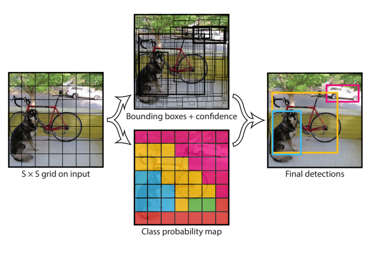
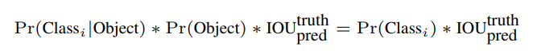
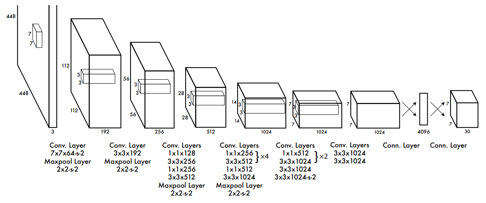
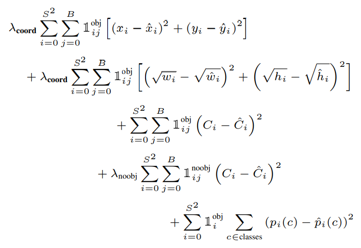

# [You Only Look Once: Unified, Real-Time Object Detection](https://arxiv.org/pdf/1506.02640.pdf)

## Abstract
- Object Detection 에 대한 새로운 접근, __YOLO__
- Object Detection 에 대한 접근 방식의 변화
    - Before: Classifier 를 Detection 을 수행하도록 수정
    - YOLO: 공간적으로 분리된 Bounding Boxes 와 연관된 Class 의 확률에 대한 회귀

- YOLO
  - Single Neural Network, One evaluation
    - 전체 이미지로부터 Bounding Boxes 와 Class 확률을 예측
    - 단일 네트워크이기 때문에 End-to-End 최적화가 가능
  - 속도 성능
    - Base YOLO: 초당 45 프레임의 이미지를 실시간으로 처리
    - Fast YOLO: 초당 155 프레임의 이미지를 실시간으로 처리
        - 속도 뿐만 아니라 탐지 성능도
          기존 실시간 Object Detection 의 mAP의 2배를 유지
  - 장단점
    - 단점: 더 많은 Localization Error 발생
    - 장점: 배경에서의 False Positive 발생 감소
  - Generalize (일반화)
    - Object 의 다양한 일반화된 표현법을 학습
    - 자연의 이미지로부터 예술작품과 같은 다른 도메인으로의 일반화에서
    DPM 과 R-CNN 을 포함한 다른 Detection 방식을 능가

## 1. Introduction

### Object Detection 의 필요성

- 인간의 빠르고 정확한 시각 시스템
  - 인간은 이미지를 힐끗 보는 것 만으로 즉시 이미지를 파악
  - 운전과 같은 복잡한 작업을 적은 주의를 기울이며 할 수 있음

- 빠르고 정확한 Object Detection Algorithm 이 있다면?
  - 특별한 센서 없이 자율주행이 가능
  - 인간 운전자를 위한 보조적인 기능 가능
    - 실시간 장면의 정보를 주는 등
  - 로봇 시스템의 반응성과 같은 일반적인 작업에 대한 잠재성 확보

### 지금까지의 Object Detection
- 현재의 Detection System
    - Classifier 가 Detection 을 수행하도록 수정하여 사용
    - Object 에 대한 Classifier 를 가져와서 다양한 위치에서 실행
    - DPM 과 같은 시스템은 슬라이딩 윈도우를 전체 이미지에 적용
    - 좀더 최근의 R-CNN 과 같은 접근
        - bounding boxes 를 생성하고, 생성한 boxes 에 대해 classifier 를 실행
        - classification 이후에 후처리 필요
          - bounding boxes 를 재정의
          - 중복 탐지 제거
          - scene 에 있는 다른 object 를 기준으로 boxes 점수를 다시 매김
    - 느리고 최적화가 어려움
        - 구성요소들이 별개로 학습되어야 함

### YOLO 소개
- Object Detection 문제를 새롭게 정의
  - 이미지의 픽셀로부터 bounding box 좌표와 class 분포로의 단일 회귀 문제
  - 이미지를 단 한번만 보고(You Only Look Once) 어떤 Object 가 있고 어디에 있는지 예측
- Simple!
  - single Convolutional Network 를 이용하여 여러개의 bounding boxes 와 그 boxes 에 대한 class 분포를 예측한다.
  - Full Image 를 학습하고 Detection 성능을 직접적으로 최적화한다.
  - 통합된 모델이기 때문에 기존의 모델들에 비해 여러 장점이 있다.

### YOLO 의 장점
- 빠르다!
  - 회귀 문제로 정의했기 때문에 복잡한 pipeline 이 필요하지 않다.
  - 새로운 이미지에 대해 단순히 우리의 신경망을 실행하면 된다.
  - 속도
    - Titan X GPU 상에서 배치처리 없이 초당 45 프레임 처리
    - 빠른 버전의 경우 초당 150 프레임 이상 처리
    - 이는 실시간 비디오 스트리밍에서 25 밀리초 이하의 지연으로 처리가 가능함을 의미
  - 정확도
    - 다른 실시간 시스템에 비해 mAP(mean average precision) 2배 이상
    - [웹페이지 접속](http://pjreddie.com/yolo/ "실시간 처리에 대한 데모를 볼 수 있음")
    
- Global Detection
  - 탐지할 때에 전체 이미지를 판단 
  - 슬라이딩 윈도우나 지역 기반 기술과 달리 YOLO 는 train 이나 test 중에 전체 이미지를 보기 때문에
    class 와 appearance 에 대한 맥락적인 정보를 암시적으로 표현한다. 
  - 최고의 Detection 방식인 Fast R-CNN 은 큰 맥락을 볼 수 없기 때문에 Object 의 배경 패치에서 실수를 한다.
  - YOLO 는 Fast R-CNN 에 비해 배경 Error 가 절반 이하이다.  

- 일반화된 표현법 학습
  - 자연 이미지로 학습하고 예술작품으로 test 했을 때,
    YOLO 는 DPM 이나 R-CNN 과 같은 최상의 Detection 방법들을 큰 격차로 능가한다.
  - YOLO 는 일반화가 가능하므로, 새로운 도메인이나 예상 못 한 입력에 대해 덜 고장난다. 

### 마무리
- 아직 정확성 측면에서 다른 최신의 Detection 시스템에 뒤쳐진다.
- 이미지에서 Object 를 빠르게 식별할 수 있는 반면, 몇몇 Object-특히나 작은 것들-을, 정확하게 localize 하는 것과 싸우고 있다.
  - 이 균형에 대해서 더 자세히 실험한다.

- 우리의 모든 training/testing code 는 open source 이다.
- 다양한 교육된 모델들도 다운받을 수 있다.

---
## 2. Unified Detection

### 기본 디자인
- 기존   의 분리되어있던 구성요소들을 하나의 신경망으로 통합
- 전체 이미지와 이미지의 모든 object 에 대해 global 하게 판단
  - 전체 이미지로부터 얻은 특징을 사용하여 각각의 bounding box 를 예측
  - 동시에 이미지의 모든 class 의 모든 bounding boxes 를 예측
- 높은 AP를 유지하면서도 end-to-end train 과 실시간의 속도를 가능하게 함
- 입력되는 이미지를 SxS **grid cell** 로 분할
  - responsible: object 의 중심이 grid cell 안에 있는 경우 해당 grid cell 은 그 object 를 탐지해야 한다.

### Grid Cell
#### B 개의 bounding box 와 각 box 에 대한 confidence score 예측
- 각각의 bounding box 는 5개의 예측값을 포함
  - (x, y): grid cell 의 offset 을 적용한 bounding box 의 중심 좌표 (0에서 1 사이 값)
     - 각 Grid Cell 의 왼쪽 위를 (0, 0), 오른쪽 아래를 (1, 1) 이라고 보고 상대적인 값으로 출력
  - w(width), h(height): 전체 이미지에 대해 상대적인 가로/세로 길이 (0에서 1 사이 값)
  - confidence score: IOU(predicted box, ground truth box)
    - 해당 box 가 object 를 포함한다는 것을 얼마나 확신하는가, 예측한 box 가 얼마나 정확하다고 생각하는가
    - Pr(Object) * IOU(truth predict) 로 정의
    - cell 안에 object 가 없으면 0
    - cell 안에 object 가 있으면 IOU(intersection over union)(box, ground truth)

#### C 개의 class 에 대한 probabilities 예측
- ")
  = Grid Cell 이 Object 를 포함할 때 Class 일 확률(조건부확률)
- Box 의 개수(B)와 관계없이, 하나의 Grid Cell 은 하나의 Class Probabilities 를 예측

### Output Value Summary
S x S 의 Grid Cell
  - 각 Cell 에 B 개의 bounding box 가 존재
    - 중심 좌표인 (x, y) 가 해당 grid cell 안에 있는 bounding box 가 B 개 존재
  - 각 bounding box 당 5개의 값 예측
    - 중심 좌표 (x, y) (Grid Cell 기준으로 정규화된 값, 0~1)
    - 가로 세로 길이 (w, h) (Full Image 기준으로 정규화된 값, 0~1)
    - confidence score
  - 각 Cell 의 Class Probabilities 예측 (Class 개수만큼 예측)

__output Tensor Size: S * S * (B * 5 + C)__

---

### 검증/시험
각 box 의 confidence 예측값과 class 조건부 확률을 곱함

confidence score 는 해당 bounding box 에 object 가 있을 확률과 
해당 object 와 bounding box 가 fit 되는 정도를 나타내므로
여기에 object 가 있을 때 class 일 확률을 곱하면 조건부 확률에 의해 아래와 같이 전개할 수 있다.

즉, class-specific confidence score 를 나타낸다.
(bounding box 가 해당 class 일 확률과 box 가 얼마나 object 에 맞는지(fit) 표현)

---

### 2.1 Network Design

- CNN 으로서 모델을 실행하고 PASCAL VOC 데이터셋 상에서 평가
- 각 layer 의 역할
   - Convolutional layer: 이미지로부터 특징을 추출
   - Fully Connected Layer: 확률과 좌표 출력값을 예측
- 24개의 Convolutional Layer + 2개의 Fully Connected Layer

- GoogLeNet 모델로부터 영감을 받음
- GoogLeNet 에서 사용된 inception module 대신
  1x1 reduction layer + 3x3 convolutional layer 를 사용
  > inception module 은? 뭐지?
  
- 빠른 버전의 YOLO
  - 9개의 Convolutional Layer 를 사용(filter 개수도 더 적음)
  - 그 외의 다른 조건은 base YOLO 와 동일

- 활성화 함수
  - 마지막 layer: 선형 활성화 함수
  - 그 외: LeakyReLU(alpha=0.1)

### 2.2 Training
- ImageNet 의 1000 class 데이터셋을 이용
- 사전 학습을 위해 20개의 conv layer, average-pooling layer, fully connected layer 사용
- 약 일주일 정도의 훈련 이후
  - ImageNet 2012 검증셋에서 (single crop) top-5 정확도 88% 성취
  - 이는 GoogLeNet 모델과 유사한 성능
- 모든 training 과 inference 에 Darknet 을 이용함

- 사전학습 이후 Detection 수행을 위해 수정
  - 성능 향상을 위해 Conv Layer 와 FC layer 를 추가
    - 근거: [Ren et al.'Object Detection Networks on Convolutional Feature Maps'](https://arxiv.org/pdf/1504.06066.pdf)
    - 무작위로 초기화된 4개의 conv layer 와 두개의 fc layer 를 추가
  - 입력값의 해상도 증가 (224 x 224 -> 448 x 448)
    - Detection 은 종종 고해상도의 시각적 정보를 필요로 함

### 모델 안정화 작업
- 아무 object 도 포함하고 있지 않은 grid cell 이 다수 존재
  - confidence score = 0 이 되므로, 다른 cell 들의 gradient 가 과해...
  - 모델 불안정, 발산 위험
- 해결방법
  - =5")
    bounding box 좌표 예측의 loss 를 증가시킴
  - =0.5")
    object 를 포함하지 않는 box 의 confidence 예측의 loss 를 감소시킴

### 최적화: Sum-Squared Error
  - output 의 sum-squared error 기준으로 최적화
    - 최적화하기 쉬움
    - AP 를 최대화하는 목적 달성을 위해서는 보완이 필요
    - localization error 와 classification error 를 같은 가중치로 취급
    - 큰 box 와 작은 box 의 에러를 같게 취급
      - 큰 box 의 작은 에러를 작은 box 의 에러보다 작게 반영해야 하므로
        bounding box 의 w, h 를 직접 예측하는 대신 w, h 의 square root 를 예측

### Responsible
- grid cell 당 여러개의 bounding box 를 예측 But object 당 하나의 bounding box 만 예측하길 원한다.
- object 에 대해서 ground truth 와 가장 높은 IOU 를 가지는 하나의 bounding box 를 'responsible' 하다고 할당
- 각각의 predictor 는 특정 크기, 가로세로 비율, object 의 class 에 대해 더 나은 예측값을 얻고 전체 recall 을 상승시킨다.

---
### Multi-part Loss Function

: 좌표 예측에 대한 가중치

: object 가 없는 경우의 가중치

: 모든 Grid Cell 에 대해 

: 각 Bounding Box 에 대해

: cell i 에 object 가 있는 경우

: cell i 의 j 번째 bounding box 가 해당 object 의 예측에 responsible 한 경우

: cell i 의 j 번째 bounding box 에 object 가 없는 경우

: x, y 좌표에 대한 sum-squared 오차 계산

: w, h 의 루트값에 대한 오차 계산

: Class 에 대한 오차 계산

: 각 class 에 대해 확률의 오차 계산

- 만약 object 가 grid cell 안에 있으면
  - classification error
- 만약 해당 object 에 responsible 하면(같은 grid cell 의 어떤 bounding box 보다도 높은 IOU 를 가지면)
  - bounding box 의 좌표 에러 추가

### Training
- 135 에포크 동안 학습을 진행
- PASCAL VOC 2007, 2012 검증 데이터를 이용
- PASCAL VOC 2012로 test (PASCAL VOC 2007의 시험 데이터도 훈련에 사용)
- batch size = 64, momentum = 0.9, decay = 0.0005
- learning rate
  - 첫 epoch: 1e-3 -> 1e-2 서서히 증가
    - 높은 학습률로 시작한다면 gradients 가 불안정하기 때문에 자주 발산함
  - 75 epoch: 1e-2
  - 30 epoch: 1e-3
  - 30 epoch: 1e-4

- Over-fitting 방지를 위해
  - Dropout
    - 레이어 사이의 co-adaptation 방지
      - Co-adaptation: 두 뉴런이 같은 역할을 수행하게 되어 의미가 없어지는 현상
    - 첫번째 connected layer 뒤에 0.5 비율로 적용
  - extensive data augmentation
    - random scaling, translation
      - 원본 이미지 크기의 최대 20% 까지
    - 노출과 포화를 랜덤으로 조정
      - 이미지의 HSV 컬러 스페이스 기준 최대값의 1.5배까지

### 2.3 Inference(추론)

- 테스트 시에도 훈련과 마찬가지로 한번의 네트워크 실행만이 필요
- PASCAL VOC 에서는 이미지당 98개의 bounding box 와 각 box 의 class 확률을 예측
- 단일 네트워크의 실행만을 필요로 하기 때문에 classifier 기반의 방식에 비해 극단적으로 빠르다.

- Grid 디자인: bounding box 예측에 있어서 공간적인 다양성을 강화

- Non maximal suppression 의 필요성
  - 일반적으로 object 가 어떤 grid cell 에 들어갈지는 명확하고 네트워크는 object 당 하나의 box 만 예측한다.
  - 그러나, 일부 큰 object 나 여러 cell 의 경계와 가까운 object 의 경우
     - 여러개의 cell 로 localize 되는 문제가 발생 (중복 탐지)
  - Non maximal suppression 을 이용하여 해결할 수 있음
  - 2~3%의 mAP 를 증가

### 2.4 YOLO 의 한계

- grid cell 당 두 개의 box 와 하나의 class 만 예측 가능 (B=2 인 경우)
  - bounding box 예측에 강한 공간적인 제약조건을 도입
    - 제약조건: 예측할 수 있는 object 의 주변의 수를 제한
    - 문제: 새떼와 같이 그룹으로 나타나는 작은 object 의 경우

- 데이터로부터 bounding box 에 대한 예측을 학습
  - 새롭거나 일반적이지 않은 비율, 설정으로 object 를 일반화시키는 것이 어려움

- 다수의 down-sampling layer
  - 상대적으로 거친 특징들을 사용하여 bounding box 를 예측

- 손실 함수
  - 작은 bounding box 와 큰 bounding box 의 에러를 같게 취급
  - 큰 박스의 작은 에러는 일반적으로 문제 없지만 작은 박스의 작은 에러는 IOU 상에 큰 영향을 준다.
  - 따라서 주 Error 발생 원인은 localization 문제

